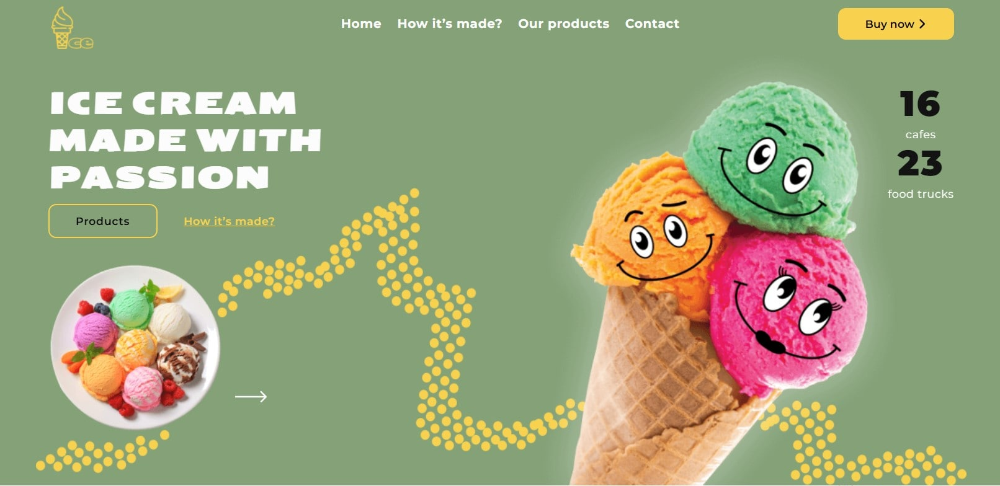
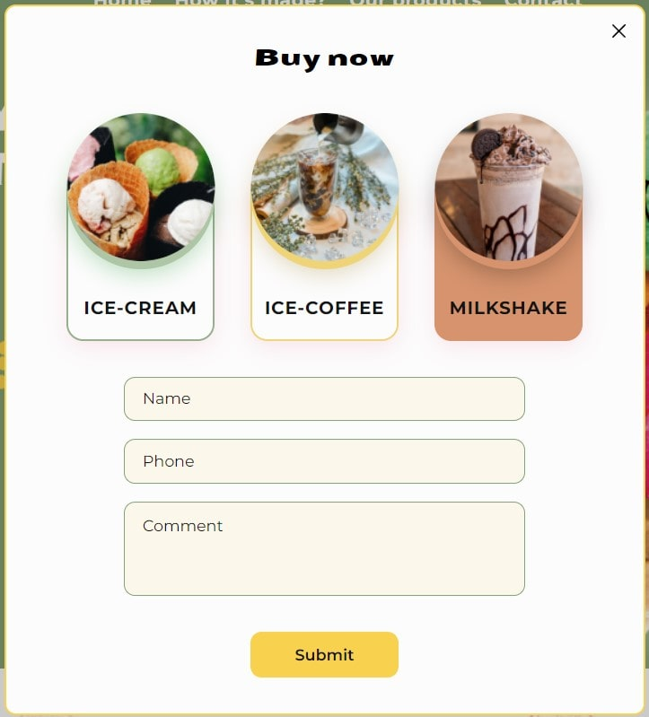
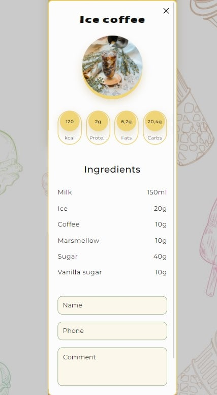

# Проєкт Сайт Морозива

Головна ідея: створити зручну, функціональну, інформативну сторінку для користувача якою буде приємно користуватись.

Термін виконання: 7 днів.

## Наша команда

Team Lead: Нікіта Лань

Scrum-Master: Євгенія Мельниченко.

Учасники проєкту:

- Костянтин Кошик

- Олександр Афанасьєв

- Марія Александрова

- Анна Настенко          

- Олексій Лещенко

- Артем Осипов

- Юлія Іщенко

- Ірина Негер

- Захар Царапов

- Анастасія Кулініч

- Артем Панасюк

## Головні фічі проєкту 

- Приємні анімації при відкритті, гарний інтерфейс

- Кожна секція кольорова і наповнена інформацією

- Додатковий фунціонал для споживачів, які хочуть знати більше

- Живі відгуки на головній сторінці

- Сайт адаптований під будь-який девайс

